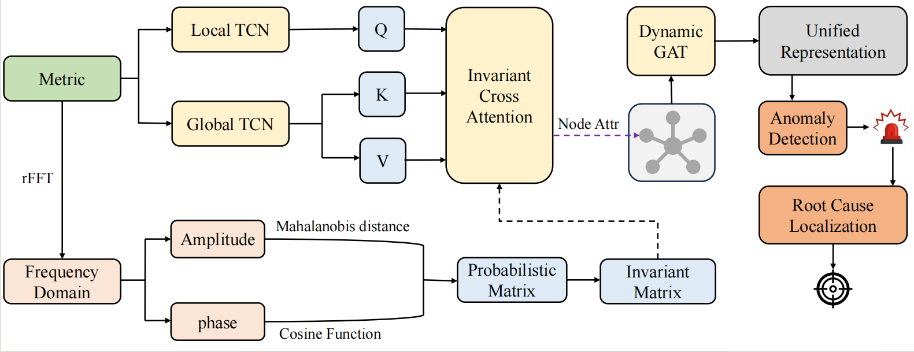

# InvarHunter: Unified Anomaly Detection and Root Cause Localization for Microservice Systems via Invariant Learning

## Architecture



 The proliferation of microservice architecture has significantly improved the scalability and agility of distributed network systems, but has simultaneously introduced formidable challenges in system fault diagnosis and maintenance. Traditional rule-based monitoring tools and existing data-driven approaches often struggle with the complex spatio-temporal dependencies and intricate service relationships in microservice environments. In particular, prior approaches seldom explicitly model invariant relationships (stable correlations that persist during normal operation) between telemetry metrics and treat anomaly detection and root cause localization as independent sequential tasks. This oversight and semantic gap hinder reliable detection and accurate localization. To overcome these challenges, we propose InvarHunter, a novel end-to-end framework for unified anomaly detection and root cause localization in microservices based on invariant learning. Specifically, InvarHunter introduces frequency domain invariant measurement to capture stable inter-metric relationships, employs a dual-path temporal convolutional network to extract both short-term and long-term temporal patterns, and designs an innovative invariant cross attention module to dynamically fuse inter-metric invariants with intra-metric temporal dependencies. The fused features are then processed by a dynamic graph attention network that learns a unified representation of the  network's service dependency graph, enabling simultaneous system-level anomaly detection and fine-grained root cause localization.  Extensive experiments on real-world datasets demonstrate that InvarHunter consistently achieves higher empirical performance than the compared baselines in both anomaly detection and root cause localization tasks.

## Requirements

- Python 3.9
- PyTorch version 1.13.1+cu117
- numpy
- scipy
- pandas
- Pillow
- scikit-learn

##  Dependencies can be installed using the following command:

```python
pip install -r requirements.txt
```

##  Datasets

The datasets used in our experiments can be accessed at https://doi.org/10.5281/zenodo.7615393.

##  Training

The instructions for running model InvarNet are as follows:

```python
python main.py
```


